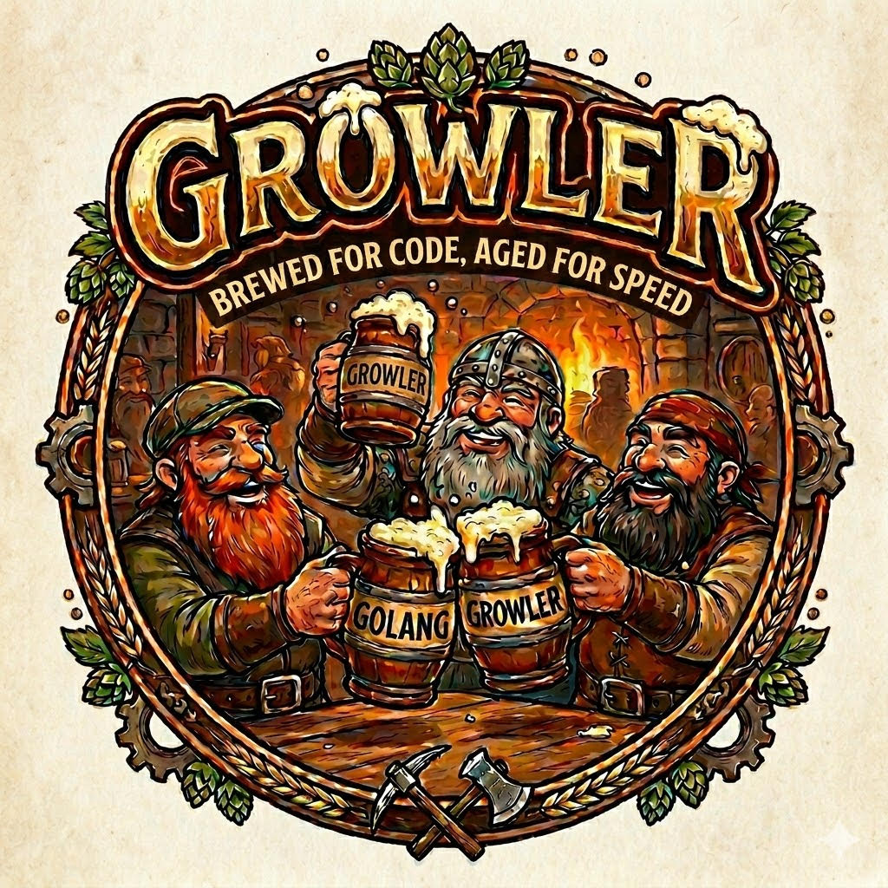

# Growler

**Growler** is an object-oriented language that transpiles to Go. Write clean, expressive OO code — get fast, idiomatic Go output.

```
fn main() {
    var name: String = "World"
    print("Hello, {name}!")
}
```

Transpiles to:

```go
func main() {
    name := "World"
    fmt.Println(fmt.Sprintf("Hello, %v!", name))
}
```

---

## Installation

```bash
git clone https://github.com/victorybhg/go-transpiler
cd go-transpiler
go build -o growler ./cmd/growler/
```

Requires Go 1.21+.

---

## CLI

```bash
growler <file.gw>               # transpile to <file>.go
growler <file.gw> -o out.go     # specify output file
growler <file.gw> --run         # transpile and run immediately
growler <file.gw> --watch       # watch for changes, re-transpile automatically
growler <file.gw> --verbose     # show token/AST debug info
growler repl                    # launch interactive REPL
```

---

## Language Reference

### Variables

```growler
var x: Int = 42
var name: String = "Growler"
var flag: Bool = true
var ratio: Float = 3.14
var maybeNull: String? = null    // optional (nullable) type
```

### Functions

```growler
fn add(a: Int, b: Int): Int {
    return a + b
}

pub fn greet(name: String): String {
    return "Hello, {name}!"
}
```

#### Default Parameter Values

Parameters may declare a default value with `= expr`. Callers that omit the argument receive the default — inlined by the transpiler into the emitted Go call site (no runtime overhead):

```growler
fn greet(name: String, greeting: String = "Hello") {
    print("{greeting}, {name}!")
}

fn main() {
    greet("Alice")              // greeting defaults to "Hello"
    greet("Bob", "Hi")          // explicit override
}
```

Transpiles to:

```go
func greet(name string, greeting string) {
    fmt.Println(fmt.Sprintf("%v, %v!", greeting, name))
}

func main() {
    greet("Alice", "Hello")
    greet("Bob", "Hi")
}
```

#### Named Arguments

Arguments may be passed by name at any call site using `name: value` syntax. Named arguments may appear in any order and can be mixed with leading positional arguments. Positional arguments must always come first.

```growler
fn connect(host: String, port: Int = 8080, tls: Bool = false) { }

fn main() {
    connect("localhost")                       // both defaults used
    connect("example.com", port: 443, tls: true)  // named, positional host
    connect(tls: true, host: "example.com")    // fully named, reordered
}
```

Named arguments also work on constructors:

```growler
class Dog {
    var name: String
    var age: Int

    construct new(name: String, age: Int = 0) {
        this.name = name
        this.age = age
    }
}

fn main() {
    var d1 = Dog.new("Rex")              // age defaults to 0
    var d2 = Dog.new("Buddy", 3)         // explicit
    var d3 = Dog.new(name: "Max")        // named, age defaults
    var d4 = Dog.new(age: 5, name: "Spot") // named, reordered
}
```

Transpiles to:

```go
func main() {
    d1 := NewDog("Rex", 0)
    d2 := NewDog("Buddy", 3)
    d3 := NewDog("Max", 0)
    d4 := NewDog("Spot", 5)
}
```

### Generic Functions

```growler
fn identity<T>(val: T): T {
    return val
}

fn pair<K, V>(key: K, value: V): K {
    return key
}
```

### Classes

```growler
class Dog {
    var name: String
    var age: Int

    construct new(name: String, age: Int = 0) {
        this.name = name
        this.age = age
    }

    pub fn bark(): String {
        return "{this.name} says: Woof!"
    }

    pub static fn create(name: String): Dog {
        return Dog.new(name)
    }
}
```

#### Named Constructors

Every class has one primary constructor declared with `construct new(...)`, called as `ClassName.new(...)`. Additional named constructors are `pub static fn` factory methods that call `new` internally:

```growler
class Point {
    var x: Float
    var y: Float

    construct new(x: Float, y: Float) {
        this.x = x
        this.y = y
    }

    // Named constructor — origin
    pub static fn origin(): Point {
        return Point.new(0.0, 0.0)
    }

    // Named constructor — from a single value
    pub static fn diagonal(v: Float): Point {
        return Point.new(v, v)
    }
}

fn main() {
    var a = Point.new(3.0, 4.0)   // primary constructor
    var b = Point.origin()         // named constructor
    var c = Point.diagonal(5.0)    // named constructor
}
```

Transpiles to:

```go
type Point struct {
    X float64
    Y float64
}

func NewPoint(x float64, y float64) *Point {
    obj := &Point{}
    obj.X = x
    obj.Y = y
    return obj
}

func Point_Origin() *Point {
    return NewPoint(0.0, 0.0)
}

func Point_Diagonal(v float64) *Point {
    return NewPoint(v, v)
}

func main() {
    a := NewPoint(3.0, 4.0)
    b := Point_Origin()
    c := Point_Diagonal(5.0)
}
```

### Generic Classes

```growler
class Box<T> {
    var value: T

    construct new(v: T) {
        this.value = v
    }

    pub fn get(): T {
        return this.value
    }
}
```

### Interfaces

```growler
interface Speaker {
    pub fn speak(): String
}

class Cat : Speaker {
    pub fn speak(): String {
        return "Meow!"
    }
}
```

### Inheritance

```growler
class Animal {
    var name: String
    construct new(name: String) { this.name = name }
    pub fn describe(): String { return "Animal: {this.name}" }
}

class Dog : Animal, Speaker {
    construct new(name: String) {
        super(name)
    }
    pub fn speak(): String { return "Woof!" }
}
```

### Enums

```growler
enum Direction { North, South, East, West }
enum Status { Pending, Active, Closed }
```

Emits Go `iota` constants:

```go
type Direction int
const (
    DirectionNorth Direction = iota
    DirectionSouth
    DirectionEast
    DirectionWest
)
```

### Match / Switch

```growler
enum Direction { North, South, East, West }

fn describe(d: Direction): String {
    match d {
        case Direction.North => { return "Going North" }
        case Direction.South => { return "Going South" }
        case Direction.East  => { return "Going East"  }
        case Direction.West  => { return "Going West"  }
        case _ => { return "Unknown" }
    }
}
```

### String Interpolation

```growler
var name: String = "Growler"
var version: Int = 1
print("Welcome to {name} v{version}!")
// → fmt.Println(fmt.Sprintf("Welcome to %v v%v!", name, version))
```

### Control Flow

```growler
// if / else if / else
if (x > 0) {
    print("positive")
} else if (x < 0) {
    print("negative")
} else {
    print("zero")
}

// while loop
while (x > 0) {
    x -= 1
}

// C-style for
for (var i: Int = 0; i < 10; i += 1) {
    print(i)
}

// for-in (range)
for item in items {
    print(item)
}
```

#### Labeled Loops

Like Java, Growler supports labeled `break` and `continue` for nested loop control. Prefix a loop with `@label` and reference it from inner loops:

```growler
@outer for (var i = 0; i < 10; i += 1) {
    for (var j = 0; j < 10; j += 1) {
        if (j == 5) {
            break @outer       // exits both loops
        }
        if (i == j) {
            continue @outer    // skips to next i iteration
        }
    }
}
```

Works with both `for` and `while` loops. Transpiles directly to Go's native labeled loops:

```go
outer:
for i := 0; i < 10; i++ {
    for j := 0; j < 10; j++ {
        if j == 5 { break outer }
        if i == j { continue outer }
    }
}
```

### Safe Navigation (`?.`)

Inspired by Kotlin, C#, Swift, and TypeScript. Access fields and call methods on nullable references without manual null checks. If the receiver is `nil`, the entire expression evaluates to `nil` — no crash, no exception:

```growler
class User {
    var name: String
    var address: Address?

    construct new(name: String, addr: Address?) {
        this.name = name
        this.address = addr
    }
}

class Address {
    var city: String
    construct new(city: String) { this.city = city }
}

fn main() {
    var user: User? = User.new("Alice", Address.new("NYC"))

    // Field access — returns nil if user is nil
    var name = user?.name           // "Alice"

    // Chaining — each ?. short-circuits independently (like Kotlin)
    var city = user?.address?.city   // "NYC"

    // Method call — skipped if receiver is nil
    user?.doSomething()

    // Nil receiver — no crash
    var nobody: User? = null
    var x = nobody?.name             // nil
    var y = nobody?.address?.city    // nil
    nobody?.doSomething()            // no-op
}
```

**Statement context** — when `?.` is used as a statement (void method call), it generates a clean nil guard:

```go
// user?.doSomething()  →
if user != nil { user.DoSomething() }
```

**Expression context** — when used in an assignment, it generates a nil-safe wrapper:

```go
// var name = user?.name  →
name := func() interface{} { if user != nil { return user.Name }; return nil }()
```

**Chained expressions** — `a?.b?.c` generates a single flat function with sequential nil checks (no nested wrappers):

```go
// var city = user?.address?.city  →
city := func() interface{} {
    _s0 := user; if _s0 == nil { return nil }
    _s1 := _s0.Address; if _s1 == nil { return nil }
    return _s1.City
}()
```

### Closures / Lambdas

Lambdas use the `(params): ReturnType => body` syntax. The body is either a
single expression or a block `{ ... }`.

```growler
// Single-expression lambda (inferred as a func literal)
var double = (x: Int): Int => x * 2
var greet  = (): String => "Hello!"

// Block-body lambda
var describe = (x: Int): String => {
    if (x > 0) {
        return "positive"
    }
    return "non-positive"
}

// Closure capture — lambda body may reference outer variables
var base   = 100
var addBase = (x: Int): Int => x + base

// String interpolation works inside lambda bodies
var makeMsg = (name: String): String => "Hello, {name}!"
```

Transpiles to idiomatic Go `func` literals:

```go
double  := func(x int) int { return (x * 2) }
greet   := func() string { return "Hello!" }
describe := func(x int) string { ... }
base    := 100
addBase := func(x int) int { return (x + base) }
makeMsg := func(name string) string { return fmt.Sprintf("Hello, %v!", name) }
```

#### Throwing lambdas

A lambda that contains `throw` automatically gets an `error` return appended to
its signature. Calls to that lambda inside a `try` block are automatically
unwrapped — you don't write any error-handling boilerplate:

```growler
var safeDivide = (a: Int, b: Int): Int => {
    if (b == 0) {
        throw Error("division by zero")
    }
    return a / b
}

try {
    var result = safeDivide(10, 2)   // unwrapped automatically
    print(result)
} catch(err) {
    print("Error: {err}")
}
```

Transpiles to:

```go
safeDivide := func(a int, b int) (int, error) {
    if b == 0 {
        return 0, fmt.Errorf("division by zero")
    }
    return (a / b), nil
}
{
    err := func() error {
        result, _err := safeDivide(10, 2)
        if _err != nil { return _err }
        fmt.Println(result)
        return nil
    }()
    if err != nil {
        fmt.Println(fmt.Sprintf("Error: %v", err))
    }
}
```

### With (Resource Management)

The `with` statement is Growler's equivalent of Java's try-with-resources, Python's `with`, and C#'s `using`. It ensures resources are cleaned up automatically when the block exits:

- **Files** (anything implementing `io.Closer`) → `defer Close()`
- **Mutexes** (anything implementing `sync.Locker`) → `Lock()` + `defer Unlock()`

No manual cleanup needed — same OO ergonomics Java/C#/Python developers expect.

```growler
import "os"

fn main() {
    with (var f = os.Stdin) {
        // f is closed automatically when the block exits
        print("reading file")
    }
}
```

#### Auto-Detected Multi-Return

Many Go functions return `(value, error)`. Growler auto-detects these and unpacks the tuple, throwing on error — no manual error handling needed:

```growler
import "os"

fn main() {
    // os.Create returns (*File, error) — auto-detected and unpacked
    with (var f = os.Create("output.txt")) {
        f.WriteString("hello from Growler")
    }
    // f is closed automatically, error was auto-checked
}
```

Transpiles to:

```go
func main() {
    {
        f, _err0 := os.Create("output.txt")
        if _err0 != nil { panic(_err0) }
        if _c, ok := any(f).(io.Closer); ok { defer _c.Close() }
        f.WriteString("hello from Growler")
    }
}
```

#### `with` + `try/catch`

When `with` is inside a `try` block, errors propagate correctly to the catch block instead of panicking:

```growler
try {
    with (var f = os.Open("/nonexistent/file")) {
        print("should not reach")
    }
} catch(err) {
    print("caught: {err}")    // caught: open /nonexistent/file: no such file or directory
}
```

#### Mutex Locking

`with` auto-detects `sync.Locker` and locks/unlocks — like Java's `synchronized` or Python's `with lock`:

```growler
import "sync"

fn main() {
    var counter = 0
    with (var mu = sync.Mutex.new()) {
        counter += 1    // mutex locked here, unlocked when block exits
    }
}
```

#### Multiple Resources

Comma-separated resources are closed in reverse order (LIFO), matching Go's `defer` stack:

```growler
import "os"

fn main() {
    with (var f1 = os.Create("a.txt"), var f2 = os.Create("b.txt")) {
        f1.WriteString("file A")
        f2.WriteString("file B")
    }
    // f2 closes first, then f1
}
```

### Error Handling

```growler
fn divide(a: Int, b: Int): Int {
    if (b == 0) {
        throw Error("division by zero")
    }
    return a / b
}

fn main() {
    try {
        var result: Int = divide(10, 0)
    } catch (err) {
        print("caught error")
    }
}
```

### Concurrency

```growler
fn main() {
    var ch: Chan<Int> = Chan.new(1)

    go {
        ch.send(42)
    }

    var val: Int = ch.receive()
    print(val)
}
```

### Tuple Unpacking

Growler maps directly to Go's multi-return. The most common use is unpacking a value + error from a `CanThrow` function (which automatically returns `(T, error)` in Go):

```growler
fn divide(a: Int, b: Int): Int {
    if (b == 0) {
        throw Error("division by zero")
    }
    return a / b
}

fn main() {
    // divide() compiles to func divide(a, b int) (int, error)
    // so we unpack both the result and the error:
    var (result, err) = divide(10, 2)
    if (err != null) {
        print("error occurred")
    } else {
        print(result)   // prints 5
    }
}
```

You can also unpack any Go function that returns multiple values via `import`:

```growler
import "strconv"

fn main() {
    // strconv.Atoi returns (int, error)
    var (n, err) = strconv.Atoi("42")
}
```

> **Note:** Both names in `var (a, b) = ...` must be used. If you only need one value, assign the other to `_` using a regular `var` and ignore it, or restructure as a `try/catch` instead.

### Imports

```growler
import "os"
import "math/rand" as rand

fn main() {
    var args: Any = os.Args
}
```

### Built-in Functions

#### I/O

| Growler            | Go equivalent              | Notes |
|-------------------|----------------------------|-------|
| `print(x)`        | `fmt.Println(x)`           | |
| `printf(fmt, ...)` | `fmt.Printf(fmt, ...)`   | |
| `readLine()`      | `bufio.NewReader(os.Stdin).ReadString('\n')` | |
| `readFile(path)`  | `os.ReadFile(path)`        | Returns string, panics on error |
| `writeFile(path, content)` | `os.WriteFile(path, []byte(content), 0644)` | Panics on error |

#### Type Conversions

| Growler            | Go equivalent              |
|-------------------|----------------------------|
| `toString(x)`     | `fmt.Sprintf("%v", x)`     |
| `parseInt(s)`     | `strconv.Atoi(s)`          |
| `parseFloat(s)`   | `strconv.ParseFloat(s,64)` |
| `toBool(s)`       | `strconv.ParseBool(s)`     |
| `typeOf(x)`       | `fmt.Sprintf("%T", x)`     |

#### Collections

| Growler            | Go equivalent              | Notes |
|-------------------|----------------------------|-------|
| `list.add(item)`  | `list = append(list, item)` | Appends to list in-place |
| `map.remove(key)` | `delete(map, key)`          | Removes key from map |
| `x.size()`        | `len(x)`                    | Works on lists, maps, strings |
| `list.clone()`    | `append(list[:0:0], list...)`| Deep-copies a list |
| `List<T>.new()`   | `[]T{}`                    | |
| `Map<K,V>.new()`  | `map[K]V{}`                | |
| `Chan<T>.new(n)`  | `make(chan T, n)`           | |

#### Math

| Growler            | Go equivalent              |
|-------------------|----------------------------|
| `abs(x)`          | `math.Abs(x)`              |
| `sqrt(x)`         | `math.Sqrt(x)`             |
| `pow(x, y)`       | `math.Pow(x, y)`           |
| `floor(x)` / `ceil(x)` / `round(x)` | `math.Floor` / `Ceil` / `Round` |
| `max(a, b)` / `min(a, b)` | `math.Max` / `math.Min` |

#### Strings

| Growler            | Go equivalent              |
|-------------------|----------------------------|
| `s.upper()` / `s.lower()` | `strings.ToUpper(s)` / `ToLower(s)` |
| `s.contains(x)`   | `strings.Contains(s, x)`  |
| `s.startsWith(x)` / `s.endsWith(x)` | `strings.HasPrefix(s, x)` / `HasSuffix(s, x)` |
| `s.trim()`         | `strings.TrimSpace(s)`     |
| `s.split(sep)`     | `strings.Split(s, sep)`    |
| `s.replace(a, b)`  | `strings.ReplaceAll(s, a, b)` |
| `list.join(sep)`   | `strings.Join(list, sep)`  |
| `sprintf(fmt, ...)` | `fmt.Sprintf(fmt, ...)`  |

#### Sorting

| Growler            | Go equivalent              |
|-------------------|----------------------------|
| `list.sort()`     | `sort.Slice(list, ...)`    |

#### JSON

| Growler            | Go equivalent              | Notes |
|-------------------|----------------------------|-------|
| `jsonEncode(val)` | `json.Marshal(val)`        | Returns JSON string |
| `jsonDecode(str)` | `json.Unmarshal(str, &m)`  | Returns `map[string]interface{}` |
| `jsonDecode(str, &target)` | `json.Unmarshal(str, target)` | Decodes into target |

#### HTTP

| Growler            | Go equivalent              | Notes |
|-------------------|----------------------------|-------|
| `httpGet(url)`    | `http.Get(url)` + read body | Returns response body as string |

#### Environment & Time

| Growler            | Go equivalent              |
|-------------------|----------------------------|
| `getEnv(key)`     | `os.Getenv(key)`           |
| `setEnv(key, val)` | `os.Setenv(key, val)`    |
| `now()`           | `time.Now()`               |
| `sleep(ms)`       | `time.Sleep(ms * time.Millisecond)` |

#### Control

| Growler            | Go equivalent              |
|-------------------|----------------------------|
| `panic(msg)`      | `panic(msg)`               |
| `exit(code)`      | `os.Exit(code)`            |

### Type System

| Growler     | Go          |
|-------------|-------------|
| `Int`       | `int`       |
| `Float`     | `float64`   |
| `String`    | `string`    |
| `Bool`      | `bool`      |
| `Any`       | `interface{}`|
| `String?`   | `*string`   |
| `List<T>`   | `[]T`       |
| `Map<K,V>`  | `map[K]V`   |
| `Chan<T>`   | `chan T`    |

---

## Examples

See the [`examples/`](examples/) directory:

- [`hello.gw`](examples/hello.gw) — Hello World + variables
- [`classes.gw`](examples/classes.gw) — Classes, interfaces, inheritance
- [`concurrency.gw`](examples/concurrency.gw) — Channels + goroutines
- [`errors.gw`](examples/errors.gw) — try/catch/throw
- [`enums.gw`](examples/enums.gw) — Enums + match
- [`generics.gw`](examples/generics.gw) — Generic functions and classes
- [`fibonacci.gw`](examples/fibonacci.gw) — Recursion
- [`closures.gw`](examples/closures.gw) — Lambdas, closures, throwing lambdas
- [`safe_navigation.gw`](examples/safe_navigation.gw) — Safe navigation `?.` with chaining
- [`with_resources.gw`](examples/with_resources.gw) — Resource management with `with`

Run any example:

```bash
./growler examples/hello.gw --run
```

---

## License

MIT
