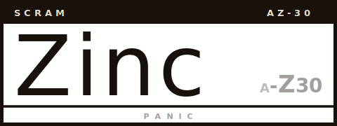

 


# Zinc

**Zinc** is an object-oriented language that transpiles to Go. Write clean, expressive OO code — get fast, idiomatic Go output.

```
main() {
    var name String = "World"
    print("Hello, {name}!")
}
```

Transpiles to:

```go
func main() {
    name := "World"
    fmt.Println(fmt.Sprintf("Hello, %v!", name))
}
```

---

## Why Zinc?

Go is fast, simple, and has excellent tooling — but its lack of traditional OO features can feel limiting for developers coming from Java, Kotlin, C#, Python, or TypeScript. Zinc bridges that gap:

- **Familiar OO syntax** — classes, interfaces, inheritance, constructors, and `this`
- **Modern conveniences** — null safety (`?.`), string interpolation, errors as values with `or` handlers, `with` resource management, lambdas, enums, generics
- **Zero runtime overhead** — everything compiles to plain Go; no reflection, no runtime library
- **Full Go interop** — import any Go package, call any Go function, use any Go type
- **Transparent output** — the generated `.go` files are readable, idiomatic, and `go vet`-clean

Zinc doesn't replace Go — it's a better way to write it.

---

## Documentation

| Document | Description |
|----------|-------------|
| [Getting Started](docs/getting-started.md) | Installation, CLI usage, and running examples |
| [Language Reference](docs/language-reference.md) | Complete syntax guide — variables, functions, classes, control flow, and more |
| [Built-in Functions](docs/builtins.md) | All built-in functions with Go equivalents |

---

## Installation

**Quick install** (Linux / macOS):

```bash
curl -sSL https://raw.githubusercontent.com/victorybhg/zinc/master/install.sh | sh
```

**Homebrew** (macOS / Linux):

```bash
brew install victorybhg/tap/zinc
```

**From source** (requires Go 1.26+):

```bash
go install github.com/victorybhg/zinc/cmd/zinc@latest
```

**Pre-built binaries**: download from [GitHub Releases](https://github.com/victorybhg/zinc/releases).

You can customize the install directory with `ZINC_INSTALL_DIR`:

```bash
ZINC_INSTALL_DIR=~/.local/bin curl -sSL https://raw.githubusercontent.com/victorybhg/zinc/master/install.sh | sh
```

---

## Quick Start

```bash
# try it
zinc examples/hello.zn --run

# start a project
mkdir myapp && cd myapp
zinc init myapp
zinc run
```

See the [Getting Started](docs/getting-started.md) guide for project setup, multi-file packages, and full CLI reference.

---

## Feature Highlights

- Classes, interfaces, and inheritance
- Generic functions and classes
- Null safety with `?.` safe navigation
- Errors as values with auto-propagation and `or` handlers
- `with` resource management (auto-close, auto-unlock)
- Closures and higher-order functions (`Fn<>` types)
- LINQ-style collection methods (`.Where()`, `.Select()`, `.Aggregate()`) with loop fusion
- Enums with `match` expressions
- String interpolation
- Default parameters and named arguments
- Labeled loops
- Tuple unpacking for multi-return functions
- Constants
- Interactive REPL

---

## License

[Apache License 2.0](LICENSE)
